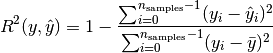
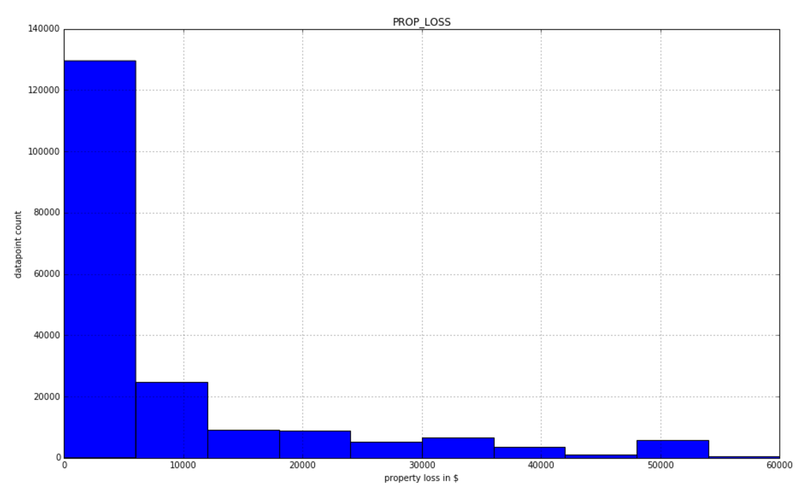
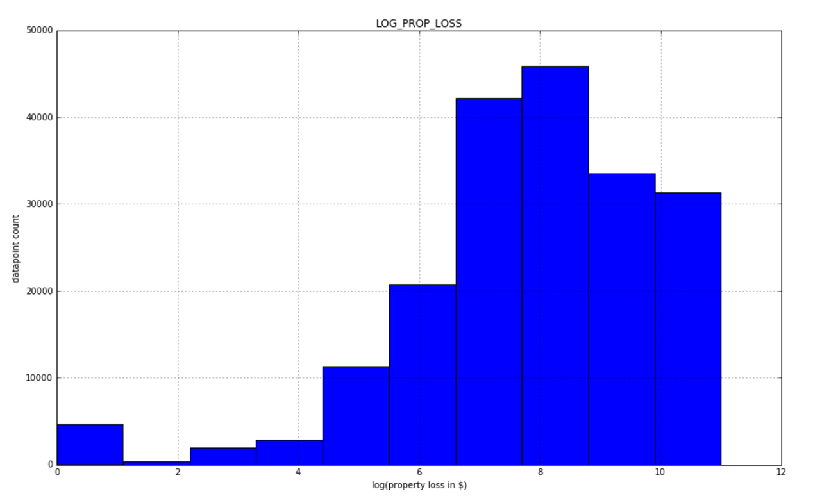
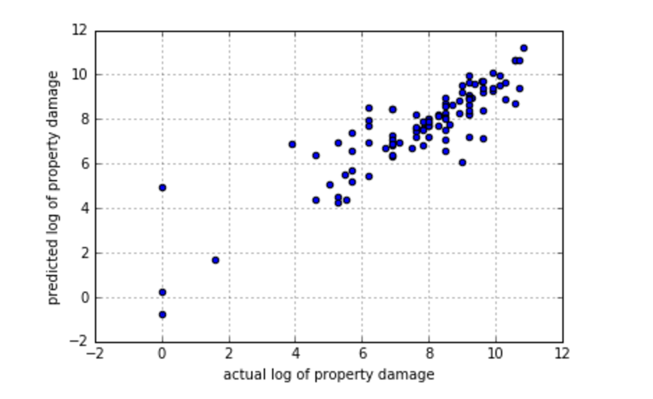
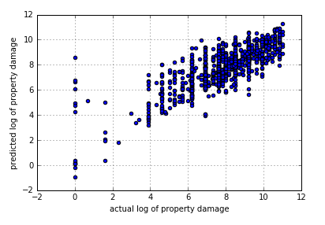

# NFIRS Property Loss Prediction Model
## Machine Learning Engineer Nanodegree
Ethan C Vizitei
August 22, 2016

## I. Firefighting and property damage

### Overview

The National Fire Incident Reporting System (NFIRS) is both a data set and a
series of software systems built around collecting data on fires in the US
and analyzing it for many purposes (national initiative effectiveness, risk
management, etc).  It was established by the USFA (United States Fire Administration)
and is freely available to the public.  Many firefighting agencies in the United
States provide data on each incident they respond to into this national system.

I personally have worked with NFIRS before on the reporting side; as a firefighter
and later an officer in the Boone County Fire Protection District, all of the
reports I wrote and some of the ad-hoc software I implemented interfaced with
the ingestion end of the NFIRS database.  Some of the interesting information
available in it is a series of categorization fields for each incident
and the total resulting property damage.

This loss data is of particular interest because when prioritizing incidents
and when doing incident preplanning, having comparative predictions of actual
likely property loss for a given structure or residence and incident type
could be very valuable to a dispatch center, insurance agency, or first due fire
officer for a response area.

### Example Use Cases for a predictive property loss algorithm:

* During a large natural disaster when many fires are reported simultaneously in real time,
a dispatch agency may choose to prioritize response to incidents (or proactively increase
the default response level to a given incident) based upon predicted property damages.

* When performing a risk analysis, an insurance agent may wish to augment their
actuarial tables with predictive property loss for this particular structure
given a range of potential incidents, thus more finely calibrating the premium
to charge for a given range of coverage.

* Officers at a fire station often choose which structures in their runbox
to do detailed preplanning on based on perceived risk. Having predicted property
loss for a range of structures could help inform priority decisions for the
most important structures to perform detailed planning exercises for.

For this project I will be using just the NFIRS data from 2011 (which is
still a very large dataset), but in a production system this dataset would
benefit from being continually adjusted for inflation and augmented
in an ongoing manner with additional data from each year as data is added to
the NFIRS database.


### Intended Approach

For this project I will be taking the raw dbase files for the 2011
NFIRS data.  The dataset is very big (2.2 million basic records)
and we don't actually need all of it as some of those incidents
are not fires (Medical, hazmat, search and rescue, etc).

I intend to reduce the set of data under consideration to just
structural fire incidents, and extract/normalize just the features
that are relevant to predicting property loss.  Then I intend
to use the sklearn framework to train a regression model
such that given a set of features for a target structure/incident,
we can make a reasonable prediction of likely real property loss.

*Possible Example Usecase:*
  A dispatch center receives a 911 call reporting a single-room fire
  inside a residential single-family dwelling at a given address.  
  That address is used by supporting software systems to query
  dimensions of the structure.  Questions from the dispatcher are used
  to establish what materials are on site and what the expected
  ignition source was, whether a fire detector has sounded, etc
  (standard questions currently asked in 911 calls during dispatch).  
  The data is fed into the model and produces an expected dollar value
  of $237,500.00 property loss from this incident.  Based on the
  unexpectedly high property loss estimate, a second alarm (
  extra fire trucks and personnel) are immediately dispatched rather
  than waiting for the first engine to arrive and size up the scene.


### Cost function and Validation

To train the algorithm, I'll be using a couple different metrics
for evaluating the accuracy of the model.

First is Mean Squared Error; in layman's terms, this is taking the sum of the
squared differences between each real y value and the predicted y value
for the current function, divided by the number of elements (the
average of the squared error in prediction).  This is formally
written as:


This is useful because it's always positive (due to squaring the difference),
but it does penalize outliers pretty heavily.  Also it's difficult
to intuitively link to the target variable because it's in squared units.
That's why we'll also be looking at the Root of Mean Squared Error.
This is simply the square root of MSE, which transforms the metric into
the same units as the variable being examined.

I'll also be using R-Squared, or as some formal texts call it the "Coefficient
of determination".  In layman's terms this is often described by saying "this
represents how much of the variation is attributable to the input variable".
It is calculated by dividing the residual sum of squares by the total sum of squares
and subtracting this quantity from one:



Naturally this means that if the model predicts every point perfectly, then it
will have an r-squared value of 1.0.  Generally 0 is the lower bound when evaluating
a regression against the points that were regressed, but in cases
like machine learning where we're scoring it against data it has not seen yet,
it's possible for r-squared to be arbitrarily bad (and therefore negative).

r-squared is a little easier to digest because of the generally bounded range,
but RMSE is in the units under consideration and is easier to have an intuitive
feel of magnitude of error.  Both metrics can be useful for evaluating a model.

## II. Analysis

### Data Exploration

Before we dive in to the data itself, a note on it's origins.  I obtained
only data for 2011 because it's provided free of paperwork from NFIRS
for being able to start playing with basic models and understanding the
format.  It is possible to request their entire dataset, but this
involves some simple authorization and paperwork which seemed
an obstacle to getting started on the modeling stage.  The gains
that I would have in model accuracy from having the additional data
from all years is discussed in the "Improvements" section at the end
of this report.

The NFIRS data arrives in a set of tables that can be joined together.
The "basicincident.dbf" file has fields that apply to all incidents,
and then there are other incident fields which are different per type
of incident being described (basicaid, arson, fireincident,
  hazmat, wildlands, etc).  For the purposes of this analysis, we're looking
at fire incidents and the property loss they cause, so we really only
need the basicincident.dbf file and the fireincident.dbf file.

There are over 2 million records in the basicincident file, but only about 600k
have a record in the fireincident table.  We'll further select out
those incidents which result in no damage (there are many) and
those that are not of a "fire" incident type (even in fire incidents, there
  are things like false alarms which are common), so our final
data set is actually closer to 200k records.

The target column we'll be looking at is "PROP_LOSS", which represents the
dollar value loss of property destroyed in a given emergency incident.  After
trimming outliers (there are several high-dollar value losses that really skew
  the data over all), here's what the distribution looks like:

```
| stat  | PROP_LOSS $ value |
| count |  196574.000000    |
| mean  |    8914.580748    |
| std   |   12933.652034    |
| min   |       1.000000    |
| 25%   |    1000.000000    |
| 50%   |    3000.000000    |
| 75%   |   10000.000000    |
| max   |   60000.000000    |
```

We can see that even after chopping off a lot of high value outliers, the data
skews heavily to the low end, with the median being $3000 even though the mean
damage is up at $8914.

After combing the fire and basic incident tables into one tabular dataset, there
are still > 130 columns to consider, many of which are not strongly related
to the output target (property loss).

Most of the fields are categorical (the type of building, the type of fire,
the type of ignition source, etc), but there are a few numeric fields
(number of firetrucks, number of response personnel, square feet of structure).

One of the challenges we have for the numeric fields is that there's plenty
of missing data.  For example, square feet.  All buildings on fire have
some square footage, but not all incident reports include it.  Out of nearly
200000 records 106645 have no square foot value included.  The rest are
distributed like this:

```
| field | SQ_FEET  |
| count |    87153 |
| mean  |    10291 |
| std   |   579840 |
| min   |        1 |
| 25%   |      800 |
| 50%   |     1200 |
| 75%   |     1944 |
| max   | 10000000 |
```

There are several fields like this, with high outliers and skewed distributions,
and a lot of missing data.  The plan for these numeric fields is to replace
missing values with the median value of the dataset to keep a lot of 0s and -1s
from throwing off the relationship, and trimming extreme outliers.


### Exploratory Visualization

One of the first things I wanted to look at was the distribution of the
target variable (the property loss value), because many of the values
tended low and I know for regression problems it's nice to have
a normal distribution.  Here's the distribution of the raw data:



It skews to the right pretty significantly. I experimented with trying to
perform a regression on it with several learners, and when I compared
them to running the same regression exercise on the log of that
target variable the difference in r-squared scores was a full 0.1 for
nearly every learner in favor of the log version.  Here's
the same data run through a logarithmic transform first:




### Algorithms and Techniques

My plan of attack was to spot check a series of regression learning
algorithms and pick a few that perform fairly well with naive parameters
to tune further.

The algorithm that performed above and beyond the other regressions
considered was Gradient Tree Boosting.  This is a process where
a sequence of weak learners are fit in sequence to try to get closer
and closer to the correct labels for given inputs.  The set of learners
are combined additively so that a prediction is really the sum of all
the weak trees in the model. The "gradient" portion is for gradient
descent, which in this case is by following a given loss function
and trying to minimize it with each step (I use "least squares" in
this project).

This algorithm has several hyper-parameters that I tuned:

*loss function*: Although I chose to use least squares, it's also
possible to use absolute error or a couple other options that are more
resilient to outliers.  In this case I removed the significant
outliers from the dataset up front, and my exhaustive grid search
yielded the best results with least squares.

*learning_rate*: this represents how much one trusts the change of
each additional weak learner.  However, since I tuned with the
n_estimators parameter I didn't mess with this much (a lower learning rate
with more learners should behave similarly to a higher learning rate
with fewer learners).

*n_estimators*: This is just the number of boosting steps to go
through, could also be though of as the number of weak learners used
in sequence.

*max_depth*: how deep any given weak learner can go, which can
help avoid overfitting.

*min_samples_split*: how big a leaf in a given tree is allowed to be.

For initial training I just used a series of default parameters to see
how the model did out of the box, then during tuning I built a grid of
possible parameter combinations and ran them exhaustively through all
combinations to see which combination yielded the best performing learner.


### Benchmark

I used a random dummy regression to produce a baseline set of scoring
metrics in order to make sure that any results I obtained were
significant.  When run over the training set of data and then predicting
against the test set, the Dummy learner performed as follows:

```
Mean Absolute Error:   1.56
Mean Squared Error:    4.44
RMSE:                  2.11
Median Absolute Error: 1.39
R - Squared:          -3.33
```

remember, those are errors off of the log of the property damage target.
I then also checked the performance of a naive linear regression just
to have a sense of how much better a given approach would do compared
to the results of a fairly simply out-of-the-box algorithm using the
same approach as the dummy (train against the training set, score
  against the test set):

```
Mean Absolute Error:   1.22
Mean Squared Error:    2.90
RMSE:                  1.70
Median Absolute Error: 0.94
R - Squared:           0.35
```

The results here are covered in detail in the AlgorithmExploration
notebook.

Since the use cases described in the project plan are based upon prioritization
between records more than precision, I have another benchmark in mind for
testing the model.  I expect that for any random set of 2 records, the model
should order their property damage predictions correctly greater than 75% of
the time (that is, it's more important that the property damage values be in the
correct order than it is that they be precise with respect to the absolute correct values).
I'll be validating this as part of the final model evaluation with 100 random samplings of 2
records.  It's also more important that records that are farther apart be ordered correctly
than ones closer together.  Therefore my other expectation is that for every
validation trial, the average prediction target difference for accurate ordering
is larger than the average prediction target difference for inaccurately OrderedDict
pairs.

## III. Methodology

### Data Preprocessing

The first step I went through was transforming the DBF files
into a format I could work with more easily (sqlite), which just
involved doing a one-to-one transformation of the tables I cared
about (2 out of something like 12 tables) from the DBF files to records in a sqlite database. See the
script at "bin/data_to_sqlite" for this transformation.

Step 2 was to take to join together the Fire incidents and Basic
incidents tables together into a single tabular row per datapoint
for easier fitting to the sklearn models later. The raw data is
structured such that a single incident might have data about it
denormalized across many tables, but what I cared about for this
process was the data in the "Fire incidents" table, and it's
accompanying  information in the "Basic Incidents" table.  
Joining them was a simple matter of iterating through all records
in the fire table, finding the accompanying record in the basic
table, and joining them together into a single record in the
output database for that step.  This is done in the script
located at "bin/join_incidents_to_one_table"

The NFIRS dataset has a lot of dimensions available.  Since I only
really have 200k data points to use, I didn't want to include everything
because I was concerned about the curse of dimensionality.  Due to this,
the first major preprocessing step I took was Feature Selection.  I took
each feature that I though might be relevant and tried to plot it against
the target variable (Property Value Loss) to see if it showed a
relationship.  The "FeatureExploration" notebook contains this work.

As a result of this visualization exercise, I selected the following inputs
which seemed to show relevant relationships:

*STATE*: which US state the incident occurred in
*INCIDENT TYPE*: (Cooking fire, chimney fire, portable building fire,
  outside fire, etc)
*AID*: whether help was received from other fire departments
*HOUR OF DAY*: What time of day the fire occurred
*CONTROLLED TIME*: how long it took the fire department to control the fire
*CLEAR TIME*: Time elapsed from arrival to departure of fire protection
units
*SUPPRESSION_APPARATUS*: How many fire trucks were sent
*SUPPRESSION_PERSONNEL*: How many firefighters were dispatched
*PROPERTY VALUE*: the initial value of the property on which the fire occurred
*DETECTOR ALERT*: was there a fire detector, did it alarm, did it alert the occupants
*HAZMAT RELEASE*: what (if any) hazardous or flammable materials were
released in the incident (Propane, paint, etc)
*PROPERTY_USE*: Primary purpose a building is used for (Mall,
  Healthcare, Residential, etc)
*MIXED_USE*: OTHER purposes a building is used for
*NOT_RESIDENTIAL*: if true, building is not used for residential
*AREA_ORIGIN*: where did the fire start? (hallway, bedroom, storage)
*HEAT_SOURCE*: what started the fire?
(Sunlight, static discharge, fireworks, etc)
*IGNITION*: Basically was it intentional, an accident, or natural
*FIRE_SPREAD*: how far did the fire spread? (object of
  origin, room of origin, floor of origin, etc)
*STRUCTURE_TYPE*: Enclosed Building, Tent, Underground, etc
*STRUCTURE_STATUS*: Under construction, normal use, vacant
*SQUARE_FEET*: exactly what it sounds like
*AES_SYSTEM*: Automatic Extinguishing System

The next step I went through was outlier removal, because there
are a lot of values that skew quite heavily to the upper end and they have
so much variance, removing outliers entirely seems like the prudent approach
for this use case.  The incidents that had astronomically high property losses
were also obviously catastrophic incidents, and what we're trying to tackle
in this problem is revealing relative property loss predictions that might not
be immediately obvious to a human actor.  I used a normal distribution
analysis in a pandas dataframe and found the line where the top 10% of the
data set started ($60,000 in damage) and removed all data points with
target values above that from the dataset.  I also removed
data points where we had no incident type or where the incident
type was not a fire, since there are many data points
for medical or rescue incidents that don't result in property
damage at all and those aren't the incidents that we're
concerned about for the problem statement mentioned in the
use cases at the beginning of this report.

All the work mentioned above so far is done in the
"reduce_to_useful_inputs" script in the bin folder.  Throughout
the project I've tried to make sure each step is a distinct
function of the data generated in the step before so that I have
checkpoint artifacts of data written to storage along the
way after each transformation to play with (this helped
enormously in debugging).

In that same script, I also began batching up features
that were generating too many dimensions.  For example,
the "STATE" feature has 50 possible values.  Encoding
this as a 1-hot vector requires 50 dimensions, and the actual
variance it represents is quite tiered, not unique
per state.  So instead of having 50 categories, I reduced
this feature to 3 categories (those abnormally cheap states,
  those which were abnormally expensive, and the remainder). Many
features with a ton of potential options were grouped in similiar
ways based on observations in the FeatureExploration notebook
(for example, rather than having hours 0-24, we use 3 categories
  with similar target variable distribution: morning/evening,
  afternoon, and overnight).

The next step was to clean up the data.  There were several records
that had many missing values or huge outliers in given inputs.
To prevent them from affecting the input too dramatically, I took
a few different approaches.  For those input features with many values
missing, I replaced missing values with the median value for that
feature (controlled time, square feet, property value, clear time,
  suppression apparatus, suppression personnel).  For those same
  features, I'd just remove their data row from
the training set entirely if the row had a very large outlier.
This process reduced the dataset from about 215k candidate datapoints
to about 192k records, and was performed in the script "bin/clean_data".

More preprocessing was still necessary, however, because categorical
input dimensions were still represented by integers at this point and
continuous data inputs had quite variable scales (apparatus might be
anywhere from 2 to 100, but square feet might be 3000 to several
hundred thousand) which could have an inadvertent weighting impact on
how significantly each input is considered.  For categorical inputs,
I used 1-hot encoded vectors to make each possible category a binary
dimension on it's own.  For continuous inputs, I used the min/max of
their distribution to transform their values to a floating point
number between 0 and 1. This work was done in the script at
"bin/normalize_data".

At this point I had a dataset of only relevant records with
all the inputs cleaned and processed ready for training.  To make
sure I had a validation set left over of totally unseen data
to check the real error rate against, I reserved about 30,000 records
at this point by removing them from the dataset and writing
them to a different datastore (random selection).  This work
can be seen in the script at "bin/split_off_test_set".

The records ready for training were now available in the
sqlite file "data/training_incidents.sqlite".


### Implementation

##### Algorithm Selection

Before commiting to a model for this data, I did an experiment with a series
of regression models available in sklearn to see out of the box which
ones seemed to score well with minimal tuning. This work is documented
in the jupyter notebook entitled "AlgorithmExploration" in the root directory.

My expectation was that the ensemble methods available for regression (particularly
  those that dependend predominantly on decision trees) would
perform far better than naive models because much of the input is categorical
rather than continuous, but I didn't want to jump to conclusions like
that without the data to support it.

Thanks to the preprocessing covered in the previous section, prep for this
exploratory pass was just loading the records from sqlite and
shredding them into an array of input vectors and an array of property loss results
(with corresponding indexes).  I then leveraged the test/train split tools
available in sklearn to split both arrays (inputs and results) into a training and test set
so that the model would be validated against data it hadn't seen yet.

Then I trained a series of models against the training dataset (inputs and results).
First in line was a dummy model, in order to see what a random regression would look
like and get a baseline r-squared score for no fit, and a naive linear regression
to show the simplest model and how well it could fit a line to the input data.
Although several metrics were evaluated to see how the models were performing,
I've included only r-squared scores here to keep the summary concise (other
  fit-scoring function outputs for each model can be seen in the notebook including
  Mean Squared Error, Mean Absolute Error, and Median Absolute Error).

| Model             | r-squared score    |
|___________________|____________________|
| Dummy             | -3.33379834123e-05 |
| Linear            |  0.347285517809    |
| Ridge             |  0.34736410869     |
| Lasso             |  0.154652051569    |
| ElasticNet        |  0.162604152044    |
| SGD               |  0.346010609807    |
| Bayseian          |  0.347298315639    |
| PassiveAggressive | -0.217769372351    |
| RANSAC            | -7.74110759857     |
| TheilSen          |  0.281932204654    |
| DecisionTree      |  0.416033472511    |
| ExtraTree         |  0.26054278424     |
| SVM               |  0.334870023831    |
| AdaBoost          |  0.407018865231    |
| Bagging           |  0.594127375415    |
| ExtraTreesEnsemble|  0.511182041209    |
| GradientBoost     |  0.63351895371     |
| RandomForest      |  0.618601161064    |

Something to point out here is that the first time I went through this exercise
the scores were much lower, with the top r-squared score not being above 0.5.
I was surprised at this, but then realized that I had not yet performed
the logarithmic transformation on the target variable, and thus the distribution was
skewed right.  The transformation produced a normal-ish distribution, and rerunning
the algorithm exploration notebook produced the data above.  Out of this
exercise, I selected Bagging, GradientBoost, and RandomForest as algorithms
for more parameter tuning to see how they performed


##### Refinement

At this point I had 3 candidate models which seemed to perform quite well with
little tuning. In order to find the hyperparameters for each model with the best
score for cross validation within the training set (default scoring function),
I made use of the GridSearchCV class within sklearn.  This involved selecting
potential parameter grids for each model and running the grid search over
them to select the parameter combination that scored the best error rate
for the provided training data.

The work described here was done in the "bin/tune_params" script.  By running
through combinations of parameters exhaustively I was able to obtain
a best score for each of the 3 models, and then compare them for final model
selection.

For the RandomForestRegressor, the input parameter grid looked like this:

```
{
  'min_samples_split': [5,9],
  'min_samples_leaf': [1,3,5],
  'n_estimators': [10,100,250],
  'max_depth': [2,3,5]
}
```

Remember, this means train a model for every combination of params here
(2*3*3*3 models) and comparing the scores; this took about an hour per model.
The top scoring Random Forest model produced a score of 0.575212520004.

For the BaggingRegressor, the input parameter grid looked like this:

```
{
  'max_features': [1.0,0.75,0.5],
  'n_estimators': [10,25,50],
  'max_samples': [1.0,0.75,0.5]
}
```

And the top scoring Bagging model got 0.632741581369

For the GradientBoostingRegressor the input parameter grid looked like this:

```
{
  'min_samples_split': [5,9],
  'min_samples_leaf': [1,3,5],
  'n_estimators': [100,250],
  'max_depth': [2,3,5]
}
```

And the top scoring GradientBoostingRegressor got 0.636959489576.

This means that Gradient boost was technically the highest scoring model
after tuning (even though Bagging is so close as to be nearly indistinguishable),
and it's final input parameters for the best score turned out to be as follows:

alpha=0.9
init=None
learning_rate=1.0
loss='ls'
max_depth=3
max_features=None
max_leaf_nodes=None
min_samples_leaf=5
min_samples_split=5
min_weight_fraction_leaf=0.0
n_estimators=100
presort='auto'
random_state=None
subsample=1.0
verbose=0
warm_start=False

At this point I took the Gradient Boosting Regressor on to validation with
the 30,000 reserved data points to make sure it wasn't overfit to the data
in the test/train split.


## IV. Results

### Model Evaluation and Validation


After the data preprocessing there were about 30,000 records reserved to use
once training was fully complete to validate the model against data it
had never seen before (even in test sets).  The plan was to compare r^2 scores and
MSE (Mean Squared Error)/RMSE between the results obtained in the model selection
and tuning passes and confirm that they weren't a result of overfitting.

In model selection the Gradient Boost model with no tuning turned up
a Mean Squared Error of 1.634.  This is difficult to put in context because
it's the squared difference between two logarithmically transformed values.
For comparison, the dummy (random) regression model produced an MSE of
4.436 (RMSE 2.106), and the naive linear regression scored an MSE of 2.895 (RMSE 1.701).
Looking at R^2 values, they're similarly ordered.  Dummy: -3.334, Linear: 0.347,
GradientBoost: 0.634.  In both metrics you can see that gradient boost gives
meaningful (non-random) information, and performs better than a naive model.

After tuning the model, Gradient Boost with ideal parameters produced
an r^2 value of 0.637 (not very much better, really, so tuning didn't gain too much
according to r^2).

The first question is whether that has been overfit to the training/test data or not.
In the model evaluation work done in the "ModelValidation" notebook, I found
a Mean Squared Error of 1.431 (RMSE 1.196) and an R^2 score of 0.677.
This would appear to indicate both that tuning _was_ meaningful (MSE has come down)
and that the model generalizes well to unseen data (MSE and R^2
both are pretty close to original values, better in fact).

Next we want to ask whether the model is robust to small changes in inputs.
Most of the input data is categorical, so it's hard to decide what "small"
changes are for those.  I did some input manipulation in the script
"./bin/example_prediction_leverage" to make sure that changing categories
didn't produce extreme differences.  Here's the output from that portion
of the script:

```
MADE UP FULL INPUT
{'AES_PRES': '2', 'AREA_ORIG': '4', 'ALARM': '112520110256', 'MIXED_USE': '58', 'AID': 2, 'HEAT_SOURC': '7', 'FIRE_SPRD': '4', 'HAZ_REL': 6, 'STRUC_STAT': '6', 'INC_TYPE': 13, 'SUP_APP': 8, 'NOT_RES': '1', 'PROP_USE': '7', 'DET_ALERT': '2', 'CAUSE_IGN': '4', 'STATE': 'CA', 'STRUC_TYPE': '4', 'SUP_PER': 24, 'INC_CONT': '112520110310', 'TOT_SQ_FT': 5000, 'LU_CLEAR': '112520110500', 'PROP_VALUE': 180000}
PREDICTION
$ 4628.92
SENSITIVITY ANALYSIS , normal changes
Alarm to middle of morning
$ 5059.3
increase responding units
$ 6587.37
decrease property value by 20 grand
$ 6878.79
change hazmat release type
$ 13961.78
knock 20 percent off of square footage
$ 11846.7
```

None of these changes from prediction to prediction seem unreasonable, though
that's a very subjective judgement.  For the continuous fields, I did perform
small changes and found they impacted the output not at all:

```
knock 20 percent off of square footage
$ 11846.7
SENSITIVITY ANALYSIS , tiny changes
add 100 square feet
$ 11846.7
change property value by $1000
$ 11846.7
```

This is because decision trees factor heavily into the model, and they are
going to find threshold values to change their output weights at.  This
seems to indicate the model is robust to tiny changes in input.


### Justification

There are two subjects to address here.  First, did the final model perform
well relative to the dummy (random) regression?  Yes, most definitey, and this
is discussed in the Model Evaluation and Validation section above.

The more important subject here is whether this model meets expectations
for being used in some of the use cases described at the beginning of this
report.  The benchmark established in the "Benchmark" section above
was that for any random set of 2 records, the model
should order their property damage predictions correctly greater than 75% of
the time, and that the average prediction target difference for accurate ordering
is larger than the average prediction target difference for inaccurately OrderedDict
pairs.  This expectation is validated in the "ModelValidation" notebook where
I took 10 passes through the validation process, each time selecting 100
pairs of data points and seeing if the model correctly ordered their predictions
(predicted the correct point of the 2 to have the higher property damage value).
I also stored the difference between the predicted value and the actual damage
value (in dollars, not logarithmic value) so that I could get the average data
point difference for the correctly ordered pairs and the incorrectly ordered pairs.
That data is included here:

```
TRIAL 1
CORRECT 84, AVG DELTA 11276.3690476
INCORRECT 16, AVG DELTA 6631.25
------------
TRIAL 2
CORRECT 76, AVG DELTA 13588.9605263
INCORRECT 24, AVG DELTA 4934.04166667
------------
TRIAL 3
CORRECT 83, AVG DELTA 16471.9156627
INCORRECT 17, AVG DELTA 7952.88235294
------------
TRIAL 4
CORRECT 85, AVG DELTA 14023.7647059
INCORRECT 15, AVG DELTA 5026.66666667
------------
TRIAL 5
CORRECT 81, AVG DELTA 14575.6790123
INCORRECT 19, AVG DELTA 7829.68421053
------------
TRIAL 6
CORRECT 81, AVG DELTA 15550.7777778
INCORRECT 19, AVG DELTA 5907.89473684
------------
TRIAL 7
CORRECT 81, AVG DELTA 14842.0864198
INCORRECT 19, AVG DELTA 7233.21052632
------------
TRIAL 8
CORRECT 84, AVG DELTA 12543.3690476
INCORRECT 16, AVG DELTA 7277.8125
------------
TRIAL 9
CORRECT 84, AVG DELTA 10724.702381
INCORRECT 16, AVG DELTA 7703.0625
------------
TRIAL 10
CORRECT 85, AVG DELTA 13098.0117647
INCORRECT 15, AVG DELTA 7410.0
------------
```

We can see in the above data set that both expectations are met.  In each trial,
greater than 75% of the pairs are ordered correctly; and in each trial the average
delta for the correctly ordered pairs was significantly greater than the average
delta for the incorrectly ordered pairs.  This indicates to me that based on
the constraints stated in the problem description, this model is sufficient
to act in those capacities.


## V. Conclusion

### Free-Form Visualization

Although the R-squared scores and benchmarks look good for the model, it's
also useful to get an intuitive feeling for how well the model predicts the
actual values for unseen data.  For that reason in the notebook named
ResultVisualization I took some time to look at the distribution of predictions
with respect to the actual values to see how well the correlated visually.

To do this I built a function that takes in the actual labels for the 30,000
record validation set and the predicted labels from the persisted model,
and seven times generated a list of 100 indexes at random to plot together
to see how they lined up.  This produced 7 graphs (all visible in that
  notebook) which show how well the predictions and actual values match.

If the match were perfect, then the scatterplot would be just a straight line
of points traveling along the line defined by y = x.  If the predictions were
poor, the plots would look aimless, or at least not very much like a line of
best fit would travel along y = x.

All the generated plots looked very similar to this one:



And the very last plot I generated had 1000 data points instead of 100.  
It's harder to get a feel for individual outliers, but it's clear how dense
the predictions are with respect to the actual values in the thickest part of
the cloud:



In both charts you should be able to see the suggestion of a linear relationship
between the two, and that it sticks reasonably close to y = x.


### Reflection

There are many observations that come to mind when thinking back over the course
of this project. The loudest one in my mind is that data cleaning and feature
selection is by far where most of my time was spent.  To break the project into
stages, I would structure it thusly (in order with percentage of time spent there):

* Project Ideation                   (4%)
* Dataset selection                  (3%)
* Feature exploration               (18%)
* Feature selection                 (12%)
* Data cleaning                     (15%)
* Data Normalization                (15%)
* Model exploration                  (8%)
* Model selection                    (2%)
* Model tuning                       (6%)
* Model verification and debugging  (10%)
* Project Writeup                    (7%)

Although the learning algorithms themselves are the most intellectually interesting
part of the whole process, learning the data and massaging it into a useful format
is really where most of my efforts were allocated.

Another notable item was the points at which I ran into problems and had to go
back and fix a transformation in pre-processing or something similar.  For example,
it wasn't until I was validating the model that I though very much about the distribution
of the target variable.  Seeing it cluster so far towards the origin made me concerned
that regression algorithms would be making bad assumptions about the distribution.

I went back to the AlgorithmExploration notebook and transformed the data in place
to log-of-target and found a 0.1 jump on average in R-squared scores, and so I
had to go back to the "normalize" step in my data transformation pipeline
and re-run the steps from there forward to take that preferred coordination into
account.  This made me _very_ glad that I had kept artifacts from each transformation
along the way; rather than having to run the whole preprocessing pipeline from
scratch, I was able to pick up at the first point in the pipeline that cared
about the particular data shape I was trying to impact and just re-run steps
from there forward.  I'll plan on continuing to use this pattern in future
projects.

Based on the rather lenient benchmarks I defined to represent success for the
use cases I was considering approaching this problem for, I'm pretty satisfied that
the model as it is would solve it well enough for general application.  I still
have some ideas for how to improve the model (see improvement section below)
and if I were packaging this model into a software solution that was taking on
real production subscribers, then I'd want to pursue some of those avenues first.

### Improvement

The first and most obvious way to improve this model is to start taking in more data.
I only made use of the NFIRS data from 2011 because it was easy to get ahold of
as a unit for general research, but NFIRS has data for every year since the 70s
and up until this year, and it's possible I could make use of all of it to further
tune the precision of the model.  Some cleaning would have to be done to account
for inflation, since property values can change significantly over a few
decades (probably pick yearly inflation numbers and normalize all data
to 2016 dollars).  I would also want to find some way to weight more recent
data points because fire behavior is different in structures built recently
with open floor plans and lightweight construction materials.

It's also possible that regression isn't the right way to model this problem for
general application.  In thinking about what I would really want to get out of
this system as a first due officer or a dispatcher, I'd probably be mapping these
projected numbers to tiered thresholds that I'd call "no big deal", "kinda problematic",
"absolutely catastrophic", etc.  We could actually do one better for them and
save a mental step by categorizing these damage levels (perhaps by absolute dollar
value or by dollar value as a ratio to property value), and having the label
output from the model be a category rather than a specific dollar figure.  This
turns the whole thing into a classification problem, and at that point I might consider
leveraging tensorflow and building a deep neural network (I'm given to understand
that neural networks may be overkill for regression problems).  I would care
more about precision in this case (getting the category right would be very important),
but it's also a softer target to hit.   This improvement would require
soliciting feedback from those with more domain expertise than I, though.
